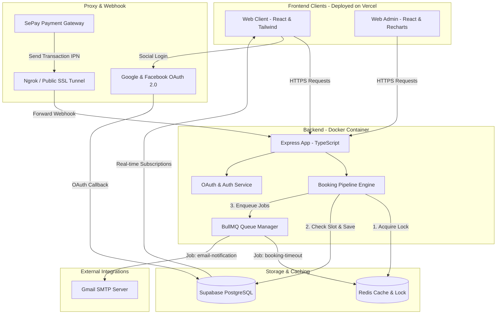

# 📸 PhotoHub Studio Booking & Management Ecosystem

PhotoHub là hệ sinh thái đặt lịch chụp ảnh và thuê thiết bị studio thời gian thực (Real-time) chuyên nghiệp. Hệ thống được tích hợp **Đăng nhập Google & Facebook OAuth 2.0**, cổng thanh toán tự động qua **SePay VietQR Webhook**, cơ chế **chống trùng lịch (Double-Booking Prevention)** bằng Redis Distributed Lock, và giải pháp đóng gói **Docker + Vercel Deployment**.

---

## 🛠️ Kiến Trúc Hệ Thống & Công Nghệ Sử Dụng

Dự án được xây dựng theo mô hình kiến trúc Client-Server hiện đại, phân tách rõ ràng trách nhiệm giữa giao diện người dùng, máy chủ điều phối và các dịch vụ lưu trữ dữ liệu thời gian thực.



### 1. Chi Tiết Các Công Nghệ Sử Dụng (Technology Stack)

| Tên Công Nghệ | Vai Trò Trong Dự Án | Mô Tả Chi Tiết |
| :--- | :--- | :--- |
| **React (Vite)** | Client & Admin Engine | Nền tảng xây dựng Single Page Application (SPA) tốc độ cao, giao diện tối giản chuẩn hiện đại. |
| **TypeScript** | Type Safety | Áp dụng trên toàn bộ Client, Admin và Backend giúp kiểm soát kiểu dữ liệu nghiêm ngặt. |
| **Tailwind CSS** | Styling System | Thiết kế giao diện sang trọng (Glassmorphism), màu sắc tối giản (sleek dark mode) kết hợp HSL tailored colors. |
| **Express (Node.js)** | RESTful API Server | Xử lý các nghiệp vụ logic phức tạp, định tuyến API, tiếp nhận Webhook từ SePay và Social Auth. |
| **Supabase (PostgreSQL)** | Database & Auth | Lưu trữ dữ liệu quan hệ, tích hợp Row-Level Security (RLS) bảo mật và dịch vụ Supabase Auth OAuth 2.0. |
| **Google & Facebook OAuth** | Social Authentication | Đăng nhập/Đăng ký nhanh chóng thông qua tài khoản Google và Facebook với trải nghiệm UX liền mạch. |
| **Redis** | Distributed Lock & Queue | Quản lý khóa phân tán ngăn chặn đặt trùng lịch (Double-booking) và làm Broker cho hàng đợi BullMQ. |
| **BullMQ** | Async Queue Manager | Quản lý hai hàng đợi ngầm: `booking-timeout` (Đếm ngược tự động hủy đơn sau 15p) và `email-queue` (Gửi email). |
| **Nodemailer** | SMTP Email Client | Kết nối trực tiếp với SMTP Google Mail để phân phối các mẫu email HTML chuyên nghiệp. |
| **SePay Webhook (IPN)** | Payment Automation | Tự động hóa quá trình xác nhận thanh toán qua giao dịch quét mã VietQR. |
| **Docker & Docker Compose** | Containerization | Đóng gói Backend Node.js và Redis vào Container độc lập, sẵn sàng deploy lên mây. |
| **Vercel** | Frontend Hosting | Hosting toàn cầu hỗ trợ CDN tốc độ cao và CI/CD tự động cho Web Client & Web Admin. |

---

## ✨ Các Tính Năng Nổi Bật & Giải Pháp Công Nghệ

### 1. 🔐 Đăng Nhập & Đăng Ký Bằng Google / Facebook OAuth 2.0
* Hỗ trợ người dùng đăng nhập 1-Click bằng tài khoản **Google** hoặc **Facebook**.
* Tự động khởi tạo và đồng bộ hồ sơ người dùng (`profiles`) trên hệ thống Supabase.
* Hỗ trợ đăng nhập không cần mật khẩu qua mã xác thực **OTP 6 chữ số** gửi tới Email.

### 2. 🛡️ Cơ Chế Chống Trùng Lịch (Double-Booking Prevention Engine)
* **Khóa phân tán (Redis Distributed Lock):** Khi khách hàng bấm đặt lịch, Backend yêu cầu khóa duy nhất trên Redis (`lock:equipment:UUID`).
* **Tính nguyên tử (Atomicity):** Chỉ luồng xử lý đầu tiên giành được khóa thành công mới được quyền kiểm tra và tạo bản ghi ở trạng thái `pending`.
* **Fallback an toàn:** Nếu Redis ngắt kết nối, hệ thống tự động kích hoạt bộ khóa In-Memory đảm bảo nghiệp vụ không gián đoạn.

### 3. 💳 Tự Động Hóa Thanh Toán Bằng SePay IPN
* **Nhận diện thanh toán thông minh:** Webhook SePay bắt tín hiệu biến động số dư tài khoản ngân hàng và gọi tới `/api/v1/payments/sepay-ipn`.
* **Trích xuất Regex nâng cao:** Bộ lọc sử dụng biểu thức chính quy `/PH([a-zA-Z0-9]{4,8})/` để trích xuất mã đơn hàng đơn lẻ hoặc mã thanh toán nhóm.
* **Duyệt đơn hàng loạt (Batch Checkout Approval):** Thanh toán cùng lúc nhiều đơn trong giỏ hàng chỉ với **1 lần quét mã VietQR**.

### 4. ⏱️ Đếm Ngược Giải Phóng Lịch Tự Động (Booking Timeout Queue)
* Khi đơn hàng khởi tạo (`pending`), hệ thống kích hoạt Job đếm ngược **15 phút** trong BullMQ.
* Nếu không chuyển khoản trong 15 phút, Job sẽ tự động chuyển đơn sang `cancelled`, giải phóng lịch trống cho khách hàng khác.

### 5. 📧 Hệ Thống Email Gửi Thật (Real SMTP Email Service)
* Gửi email HTML tự động cho các sự kiện: Khởi tạo đơn (`pending`), Đã duyệt đơn (`approved`), Hủy đơn (`cancelled`).

---

## 🚀 Hướng Dẫn Chạy Dự Án Cục Bộ (Local Setup)

### 1. Yêu Cầu Tiền Đề
- Node.js >= 20.x
- Docker & Docker Compose (Nên có)

### 2. Khởi Động Redis & Backend bằng Docker
```bash
# Clone dự án về máy
git clone https://github.com/your-username/photohub.git
cd photohub

# Cấu hình file môi trường backend
cp backend/.env.example backend/.env

# Khởi động Backend và Redis bằng Docker Compose
docker-compose up -d --build
```
*Backend API sẽ chạy tại: `http://localhost:3000`*

### 3. Khởi Động Web Client (Frontend)
```bash
cd web-client

# Cấu hình file môi trường frontend
cp .env.example .env

# Cài đặt thư viện & chạy dev server
npm install
npm run dev
```
*Web Client sẽ chạy tại: `http://localhost:5173`*

---

## ☁️ Hướng Dẫn Deploy Sản Phẩm

### 1. Deploy Frontend (`web-client` & `web-admin`) lên Vercel
1. Đẩy mã nguồn dự án lên **GitHub**.
2. Truy cập **[Vercel Dashboard](https://vercel.com)** $\rightarrow$ **Add New Project** $\rightarrow$ Chọn Repository `photohub`.
3. Điền các biến môi trường tại mục **Environment Variables**:
   - `VITE_SUPABASE_URL`: URL dự án Supabase của bạn
   - `VITE_SUPABASE_ANON_KEY`: Anon Key công khai
   - `VITE_API_URL`: URL Backend đã deploy (ví dụ: `https://your-backend.onrender.com`)
4. Bấm **Deploy**.

### 2. Deploy Backend (`backend`) bằng Docker Container
1. Tải ứng dụng lên các nền tảng hỗ trợ Docker như **Render.com**, **Railway.app**, hoặc **DigitalOcean App Platform**.
2. Đảm bảo cấu hình các biến môi trường từ [backend/.env.example](file:///d:/thuctap/photohub/backend/.env.example) lên trang quản trị dịch vụ mây.

---

## 👥 Bản Quyền & Phát Triển
* Dự án được phát triển và tối ưu hóa liên tục bởi đội ngũ lập trình viên **PhotoHub Studio Ecosystem**.
* Mọi thắc mắc hoặc đóng góp xin gửi về Email: `nguyentruong09102002@gmail.com`.
