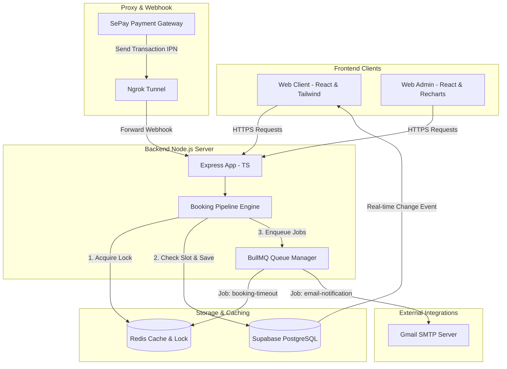

# 📸 PhotoHub Studio Booking & Management System

PhotoHub là một hệ sinh thái đặt lịch chụp ảnh và thuê thiết bị studio thời gian thực (Real-time) chuyên nghiệp, được tích hợp cổng thanh toán tự động qua SePay (VietQR Webhook) và cơ chế phòng chống trùng lịch (Double-booking Prevention) tối tân sử dụng Redis Distributed Lock.

---

## 🛠️ Kiến Trúc Hệ Thống & Công Nghệ Sử Dụng

Dự án được xây dựng theo mô hình kiến trúc Client-Server hiện đại, phân tách rõ ràng trách nhiệm giữa giao diện người dùng, máy chủ điều phối và các dịch vụ lưu trữ dữ liệu thời gian thực.



### 1. Chi Tiết Các Công Nghệ Sử Dụng (Technology Stack)

| Tên Công Nghệ | Vai Trò Trong Dự Án | Mô Tả Chi Tiết |
| :--- | :--- | :--- |
| **React (Vite)** | Client & Admin Engine | Nền tảng xây dựng Single Page Application (SPA) tốc độ cao, hỗ trợ Hot Module Replacement (HMR) tức thì cho trải nghiệm lập trình vượt trội. |
| **TypeScript** | Type Safety | Áp dụng trên toàn bộ Client, Admin và Backend giúp kiểm soát kiểu dữ liệu nghiêm ngặt, giảm thiểu 99% lỗi runtime khi tương tác. |
| **Tailwind CSS** | Styling System | Sử dụng để thiết kế giao diện mang phong cách cao cấp (Glassmorphism), màu sắc tối giản (sleek dark mode) kết hợp với các HSL tailored colors. |
| **Express (Node.js)** | RESTful API Server | Xử lý các nghiệp vụ logic phức tạp, định tuyến API, tiếp nhận Webhook từ SePay và làm trung gian điều phối cho hệ thống. |
| **Supabase (PostgreSQL)** | Database & Real-time | Lưu trữ dữ liệu quan hệ, tích hợp Row-Level Security (RLS) bảo mật dữ liệu cấp dòng và cung cấp cổng Real-time Subscriptions cập nhật tức thì lên UI. |
| **Redis** | Distributed Lock & Queue | Quản lý khóa phân tán ngăn chặn việc đặt lịch trùng lặp (Double-booking) và làm Broker cho hàng đợi xử lý tác vụ ngầm (BullMQ). |
| **BullMQ** | Async Queue Manager | Quản lý hai hàng đợi ngầm quan trọng: `booking-timeout` (Đếm ngược tự động hủy đơn) và `email-queue` (Hàng đợi gửi email bất đồng bộ). |
| **Nodemailer** | SMTP Email Client | Kết nối trực tiếp với SMTP Google Mail để phân phối các mẫu email HTML chuyên nghiệp cho khách hàng theo thời gian thực. |
| **SePay Webhook (IPN)** | Payment Automation | Tự động hóa quá trình xác nhận thanh toán thông qua giao dịch quét mã VietQR và gửi phản hồi thông báo tức thời (IPN) qua cổng bảo mật. |

---

## ✨ Các Tính Năng Nổi Bật & Giải Pháp Công Nghệ

### 1. Cơ Chế Chống Trùng Lịch (Double-Booking Prevention Engine)
Để giải quyết triệt để bài toán hai khách hàng cùng đặt một khung giờ (Slot) của Nhiếp ảnh gia hoặc Thiết bị tại một thời điểm:
* **Khóa phân tán (Redis Distributed Lock):** Khi khách hàng bắt đầu ấn nút thanh toán, Backend sẽ yêu cầu một khóa duy nhất trên Redis tương ứng với tài nguyên đó (Ví dụ: `lock:equipment:UUID`).
* **Tính nguyên tử (Atomicity):** Chỉ một luồng xử lý (request) đầu tiên giành được khóa thành công mới được quyền kiểm tra trạng thái trống của lịch và tạo bản ghi ở trạng thái `pending`. Các request đến sau sẽ phải đợi hoặc bị từ chối ngay lập tức.
* **Fallback an toàn:** Nếu Redis gặp sự cố, hệ thống tự động kích hoạt bộ khóa In-Memory đảm bảo luồng đặt lịch không bị gián đoạn.

### 2. Tự Động Hóa Thanh Toán Bằng SePay IPN
* **Nhận diện thanh toán thông minh:** Webhook SePay bắt tín hiệu biến động số dư tài khoản ngân hàng và gọi tới `/api/v1/payments/sepay-ipn`.
* **Trích xuất Regex nâng cao:** Bộ lọc sử dụng biểu thức chính quy `/PH([a-zA-Z0-9]{4,8})/` để trích xuất cả mã đơn hàng đơn lẻ dạng UUID rút gọn (8 ký tự) hoặc mã thanh toán nhóm giỏ hàng (4 ký tự như `PHABCD`).
* **Duyệt đơn hàng loạt (Batch Checkout Approval):** Nếu khách hàng chọn thanh toán cùng lúc nhiều đơn trong giỏ hàng, hệ thống chỉ tạo duy nhất 1 mã nhóm. Khi nhận được tiền, Webhook sẽ cập nhật trạng thái `approved` (Đã duyệt) đồng loạt cho toàn bộ các đơn con trong giỏ hàng chỉ với 1 giao dịch quét mã QR.

### 3. Đếm Ngược Giải Phóng Lịch Tự Động (Booking Timeout Queue)
* Khi đơn hàng tạo thành công ở trạng thái `pending`, hệ thống sẽ kích hoạt một Job đếm ngược **15 phút** trong BullMQ (hoặc bộ nhớ tạm `setTimeout` dự phòng).
* Trong vòng 15 phút, nếu khách hàng không hoàn tất việc chuyển khoản, Job sẽ kích hoạt tiến trình tự động hủy đơn (`cancelled`), giải phóng Slot thời gian của Thiết bị/Nhiếp ảnh gia đó để khách hàng khác có thể đặt lịch.
* Nếu thanh toán thành công trước thời hạn, Job đếm ngược sẽ tự động bị gỡ bỏ hoặc kiểm tra trạng thái và bỏ qua.

### 4. Hệ Thống Email Gửi Thật (Real SMTP Email Service)
Tận dụng kiến trúc hàng đợi bất đồng bộ của BullMQ, hệ thống gửi email HTML sắc nét cho khách hàng ngay lập tức mà không làm chậm thời gian phản hồi API của người dùng:
* **Email Khởi tạo đơn (`pending`):** Chứa thông tin đơn hàng, số tiền và thông tin tài khoản chuyển khoản.
* **Email Đã duyệt đơn (`approved`):** Gửi lời cảm ơn kèm chi tiết thời gian và thông tin liên hệ của Nhiếp ảnh gia.
* **Email Hủy đơn (`cancelled`):** Thông báo đơn hàng bị hủy do quá hạn thanh toán hoặc chủ động hủy.

---

## 🚀 Hướng Dẫn Cài Đặt & Khởi Chạy Nhanh

### 1. Chuẩn Bị File Cấu Hình `.env`

Tạo file `.env` ở thư mục **backend** và **web-client** tương ứng với các trường khóa sau:

#### Cho Backend (`backend/.env`):
```env
PORT=3000
SUPABASE_URL=https://your-supabase-url.supabase.co
SUPABASE_SERVICE_ROLE_KEY=your-service-role-key
REDIS_HOST=127.0.0.1
REDIS_PORT=6379

# Cấu hình đối soát tự động SePay
SEPAY_SECRET_KEY=spsk_live_your_sepay_secret_key
SEPAY_IPN_URL=https://compare-flail-muster.ngrok-free.dev/api/v1/payments/sepay-ipn

# Cấu hình SMTP Email gửi thật (Gmail App Password)
SMTP_HOST=smtp.gmail.com
SMTP_PORT=587
SMTP_USER=nguyentruong09102002@gmail.com
SMTP_PASS=your-gmail-app-password
SMTP_SENDER="PhotoHub Studio <nguyentruong09102002@gmail.com>"
```

#### Cho Web Client (`web-client/.env`):
```env
VITE_SUPABASE_URL=https://your-supabase-url.supabase.co
VITE_SUPABASE_ANON_KEY=your-supabase-anon-key
VITE_API_URL=http://localhost:3000
```

### 2. Khởi Chạy Docker Services (Redis)
Mở terminal tại thư mục gốc của dự án và khởi chạy Redis:
```bash
docker-compose up -d
```

### 3. Cài đặt và Khởi chạy Backend
```bash
cd backend
npm install
npm run dev
```

### 4. Cài đặt và Khởi chạy Web Client
```bash
cd ../web-client
npm install
npm run dev
```

Truy cập website tại: [http://localhost:5173](http://localhost:5173).

---

## 👥 Bản Quyền & Phát Triển
* Dự án được phát triển và tối ưu hóa liên tục bởi đội ngũ lập trình viên PhotoHub.
* Mọi đóng góp xin gửi về địa chỉ Email: `nguyentruong09102002@gmail.com`.
