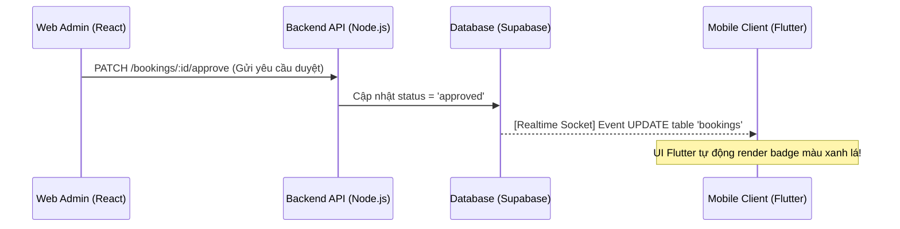

# Hướng dẫn Phát triển & Tích hợp Frontend (React.js & Flutter)

Tài liệu này hướng dẫn chi tiết cách thiết lập cấu trúc thư mục, tích hợp API Node.js và đồng bộ dữ liệu Realtime từ Supabase cho hai ứng dụng Frontend trong hệ sinh thái **PhotoHub**:
1. **Frontend Web Admin (React.js + TailwindCSS)**: Quản lý kho bãi, duyệt đơn hàng và thống kê.
2. **Frontend Mobile Client (Flutter + BLoC/Provider)**: Khách hàng đặt lịch, thuê thiết bị và nhận trạng thái đơn chụp.

---

## 🚀 1. Frontend Web (React.js + TailwindCSS)

Dành cho **Studio Manager (Admin)** để vận hành thiết bị, phê duyệt các yêu cầu thuê máy và theo dõi biểu đồ doanh thu.

### 📁 Cấu trúc thư mục khuyến nghị (Modular Structure)
```text
src/
├── assets/             # Hình ảnh, font chữ, icons
├── components/         # Các UI component dùng chung (Button, Modal, Table...)
├── config/             # Cấu hình Supabase Client, Axios instance
│   └── supabase.js
├── layouts/            # Layout Admin (Sidebar, Header, Footer)
├── pages/              # Các trang giao diện chính
│   ├── Dashboard/      # Trang tổng quan & biểu đồ doanh thu
│   ├── Equipment/      # Quản lý CRUD thiết bị (Nikon, Canon...)
│   └── Bookings/       # Danh sách đơn hàng & nút "Duyệt đơn"
├── services/           # Gọi API backend (Axios/Fetch)
│   └── booking.service.js
└── App.jsx
```

### 🔌 Cấu hình Supabase Client & API Service
Cần tích hợp Supabase JS SDK để lắng nghe Realtime và Axios để gọi API duyệt đơn.

#### Cấu hình Supabase Client (`src/config/supabase.js`)
```javascript
import { createClient } from '@supabase/supabase-js';

const supabaseUrl = import.meta.env.VITE_SUPABASE_URL;
const supabaseAnonKey = import.meta.env.VITE_SUPABASE_ANON_KEY;

export const supabase = createClient(supabaseUrl, supabaseAnonKey);
```

#### Gọi API duyệt đơn chụp (`src/services/booking.service.js`)
Khi Admin nhấn nút **"Duyệt đơn" (Approved)**, thay vì gọi trực tiếp vào DB, ta gửi request lên backend để đảm bảo logic:
```javascript
import axios from 'axios';

const API_BASE_URL = 'http://localhost:3000'; // Hoặc đường dẫn deploy thực tế

export const approveBooking = async (bookingId, token) => {
  const response = await axios.patch(
    `${API_BASE_URL}/bookings/${bookingId}/approve`, 
    {}, 
    {
      headers: {
        Authorization: `Bearer ${token}`
      }
    }
  );
  return response.data;
};
```

---

## 📱 2. Frontend Mobile (Flutter + BLoC/Provider)

Dành cho **Khách hàng** đặt lịch, xem danh sách máy ảnh/ống kính và nhận cập nhật trạng thái đơn realtime.

### 📁 Cấu trúc thư mục khuyến nghị (Feature-First)
```text
lib/
├── core/
│   ├── constants/       # URL API, màu sắc, font chữ
│   ├── network/         # HTTP Client (Dio / http)
│   └── theme/           # Cấu hình Dark/Light Mode
├── data/
│   ├── models/          # Lớp dữ liệu (BookingModel, EquipmentModel)
│   └── repositories/    # Lớp kết nối API & local storage
├── logic/
│   └── cubits/blocs/    # Quản lý trạng thái (Auth, Booking, RealtimeStream)
└── presentation/
    ├── screens/         # Màn hình giao diện (Home, Details, BookingForm)
    └── widgets/         # Widget tái sử dụng (EquipmentCard, StatusBadge)
```

### 🔌 Gọi API Đặt Lịch từ Flutter (Dart)
Sử dụng gói `http` hoặc `dio` để gửi yêu cầu đặt lịch lên server Node.js.

```dart
import 'dart:convert';
import 'package:http/http.dart' as http;

class BookingRepository {
  final String _baseUrl = 'http://localhost:3000'; // Đổi IP nếu chạy máy ảo

  Future<Map<String, dynamic>> createBooking({
    required String clientId,
    String? photographerId,
    String? equipmentId,
    required DateTime startDate,
    required DateTime endDate,
    required String userToken,
  }) async {
    final response = await http.post(
      Uri.parse('$_baseUrl/bookings'),
      headers: {
        'Content-Type': 'application/json',
        'Authorization': 'Bearer $userToken',
      },
      body: jsonEncode({
        'client_id': clientId,
        'photographer_id': photographerId,
        'equipment_id': equipmentId,
        'start_date': startDate.toIso8601String(),
        'end_date': endDate.toIso8601String(),
      }),
    );

    final data = jsonDecode(response.body);
    if (response.statusCode == 201) {
      return data;
    } else {
      throw Exception(data['error'] ?? 'Lỗi tạo đơn chụp');
    }
  }
}
```

---

## ⚡ 3. Đồng bộ trạng thái Realtime (Web ⇄ Mobile)

Một trong những trải nghiệm quan trọng nhất của hệ sinh thái **PhotoHub** là khi Admin **Duyệt đơn** trên Web, trạng thái đơn chụp trên màn hình điện thoại của Khách hàng lập tức cập nhật thành màu xanh lá mà không cần tải lại trang.

### Cơ chế hoạt động:


### Cách triển khai lắng nghe trên Flutter:
Sử dụng package `supabase_flutter` để lắng nghe sự thay đổi của bảng `bookings`:

```dart
import 'package:supabase_flutter/supabase_flutter.dart';

class RealtimeBookingService {
  final _supabase = Supabase.instance.client;

  // Lắng nghe sự thay đổi của một đơn hàng cụ thể
  Stream<List<Map<String, dynamic>>> streamBookingStatus(String bookingId) {
    return _supabase
        .from('bookings')
        .stream(primaryKey: ['id'])
        .eq('id', bookingId);
  }
}

// Tích hợp vào StreamBuilder của Flutter UI
StreamBuilder<List<Map<String, dynamic>>>(
  stream: RealtimeBookingService().streamBookingStatus(currentBookingId),
  builder: (context, snapshot) {
    if (!snapshot.hasData || snapshot.data!.isEmpty) {
      return const CircularProgressIndicator();
    }
    
    final booking = snapshot.data!.first;
    final status = booking['status']; // 'pending', 'approved', 'ongoing'...
    
    return StatusBadge(status: status); // Widget đổi màu theo trạng thái
  },
);
```

---

## 🔒 4. Các lưu ý bảo mật quan trọng (Best Practices)
1. **Sử dụng RLS (Row Level Security)**: Luôn bật RLS trên Supabase. Flutter Client chỉ nên thực hiện truy vấn trực tiếp bằng SDK với các chính sách SELECT/INSERT nghiêm ngặt.
2. **Không gọi API bypass RLS trực tiếp từ FE**: Các logic như kiểm tra thiết bị trống lịch, tính giá tiền, áp mã giảm giá phải luôn chạy qua API Backend (Node.js) để tránh Client giả mạo tổng giá tiền (`total_price`).
3. **Mã hoá kết nối**: Đảm bảo sử dụng giao thức `https` (cho API) và `wss` (cho Supabase realtime) khi triển khai môi trường Production.
